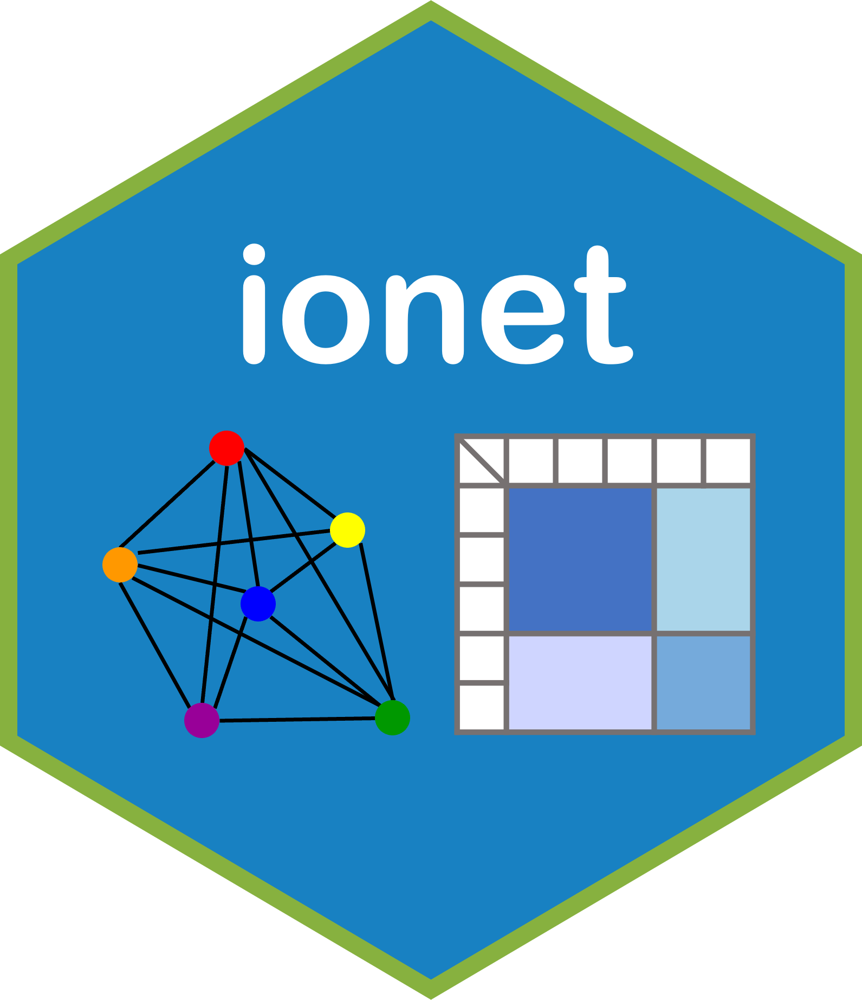

# ionet 

<!-- badges: start -->
[](https://github.com/Carol-seven/ionet/actions)
[](https://doi.org/10.1016/j.physa.2022.128200)
<!-- badges: end -->

The goal of **ionet** is to develop network functionalities specialized
for the data generated from input-output tables.


## Installation

You can install the development version of **ionet** from
[GitHub](https://github.com/) with:

``` r
# install.packages("devtools")
devtools::install_github("Carol-seven/ionet")
```


## Function

`btw()`: betweenness centrality measure that incorporates available node-specific
auxiliary information based on strongest path.

`dijkstra()`: implementation of the Dijkstra’s algorithm to find the shortest paths from
the source node to all nodes in the given network.


## Data \| Input-Output Tables

| Database                                   | Economies |   Years   | Sectors |
|:-------------------------------------------|:---------:|:---------:|:-------:|
| the National Bureau of Statistics of China |   China   |   2002    |   122   |
|                                            |           |   2005    |   42    |
|                                            |           |   2007    |   135   |
|                                            |           |   2010    |   41    |
|                                            |           |   2012    |   139   |
|                                            |           |   2015    |   42    |
|                                            |           |   2017    |   149   |
|                                            |           |   2017    |   42    |
|                                            |           |   2018    |   153   |
|                                            |           |   2018    |   42    |
|                                            |           |   2020    |   153   |
|                                            |           |   2020    |   42    |
| OECD Input-Output Tables 2021 edition      |   China   | 1995–2018 |   45    |
| OECD Input-Output Tables 2021 edition      |   Japan   | 1995–2018 |   45    |


## Recommended Citation

Xiao, S., Yan, J. and Zhang, P. (2022).
Incorporating auxiliary information in betweenness measure for input-output networks.
*Physica A: Statistical Mechanics and its Applications*, 607, 128200.
[DOI](https://doi.org/10.1016/j.physa.2022.128200).
